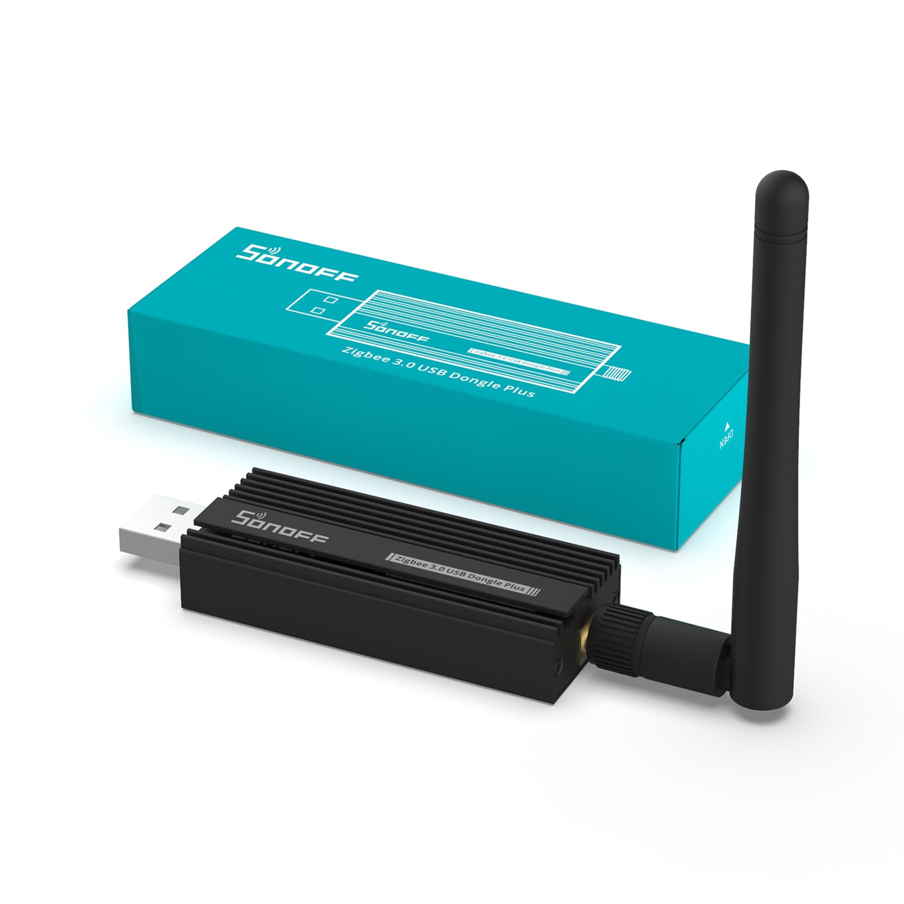
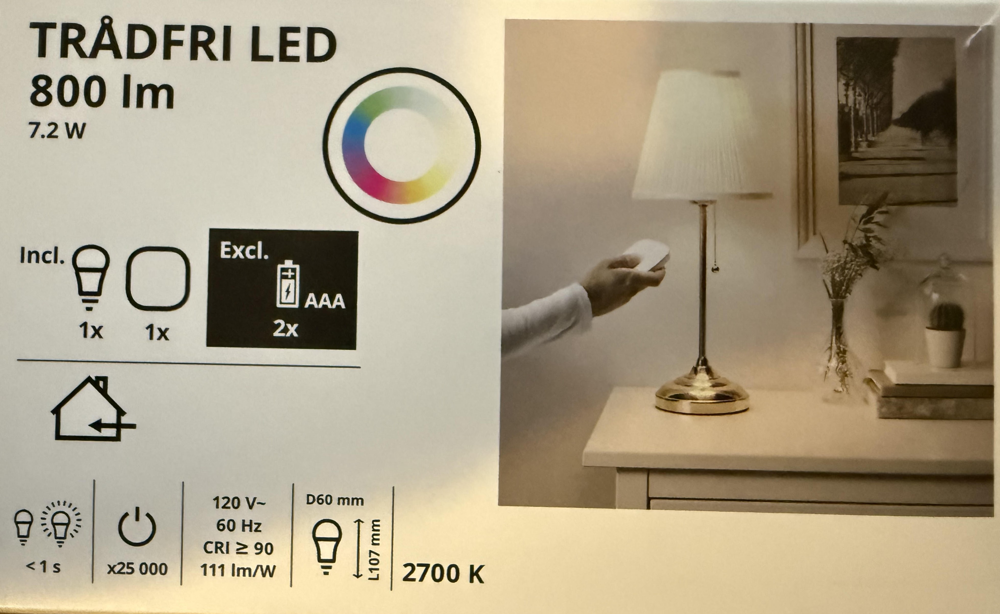
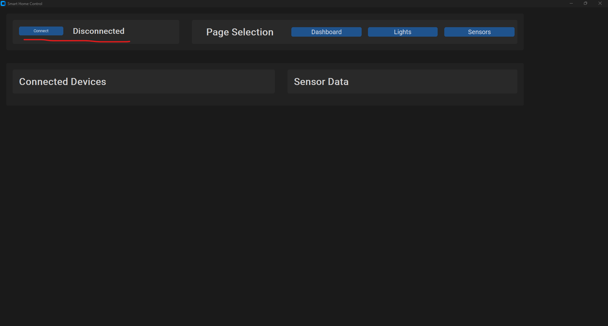
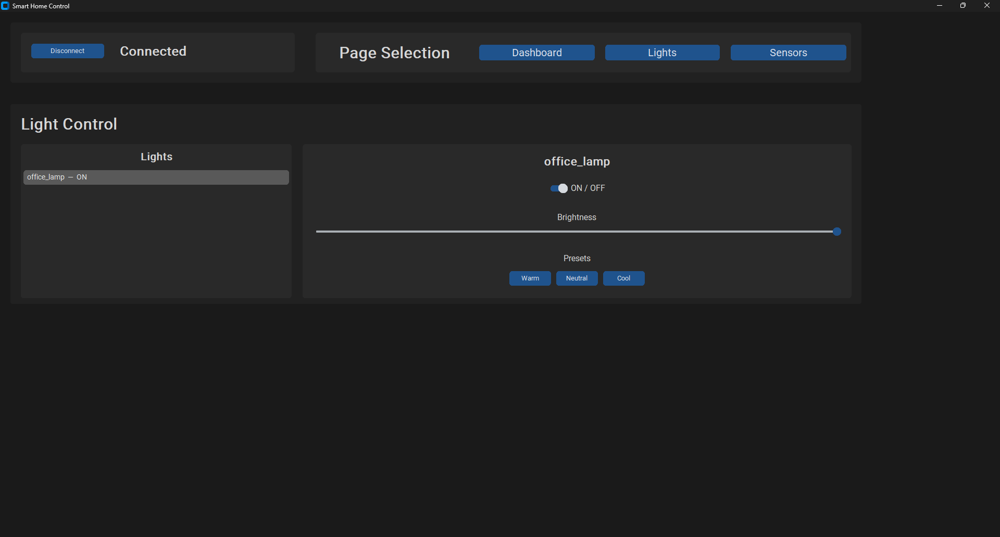
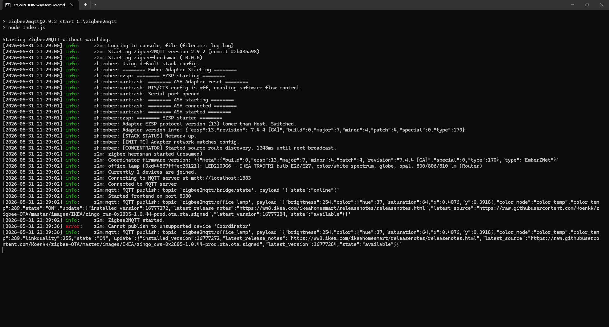

# Zigbee Smart Home Control
 
A desktop GUI for controlling Zigbee smart home devices through Zigbee2MQTT. Built with Python and CustomTkinter.
 
## What It Does
 
- Connects to a local Zigbee2MQTT instance over MQTT
- Lists all connected Zigbee devices and their current status
- Controls smart lights: power on/off, brightness, and color temperature presets (warm, neutral, cool)
- Sensor monitoring page (WIP)
- Light bulb color control (WIP)
## Requirements

- [Zigbee2MQTT](https://www.zigbee2mqtt.io/) 
- pnpm (used to start the Zigbee2MQTT service)
- An MQTT broker running on localhost (port 1883)

## Hardware
 
  
 **Sonoff Zigbee 3.0 USB Dongle** 
 
   
 **IKEA TRÅDFRI LED** 

### Python Dependencies
 
- customtkinter
- paho-mqtt

 
## Usage
 
Make sure Zigbee2MQTT and your MQTT broker are set up, then run:
 
```
python smart_home_gui.py
```
 
Click **Connect** to join the network. The dashboard will populate with devices. Use the **Lights** page to select a light and adjust its settings.

## Screenshots
 
### Dashboard — Disconnected

 
### Light Control — Connected

 
### Zigbee2MQTT Console Output

 
## Notes
 
- The app currently expects Zigbee2MQTT installed at `C:\zigbee2mqtt` and launches it via pnpm on startup.
- Sensor support is planned but not yet implemented.
- The app cleans up the MQTT connection and Zigbee2MQTT process on window close.
## Author
 
Robert Hudson
